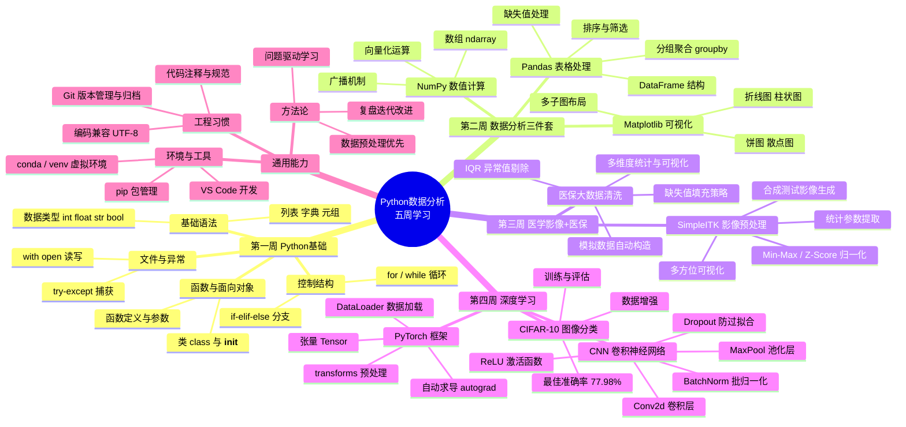

# Python数据分析 · 五周知识思维导图

> 使用 Mermaid mindmap 语法绘制，可在 VS Code（Markdown Preview Mermaid Support）、Typora 或 GitHub 中直接预览渲染。



---

## 核心主线

```
数据(原始) → 预处理(清洗/归一化) → 分析(统计/建模) → 可视化(洞察) → 总结(复盘)
```

| 周次 | 数据形态 | 核心工具 | 核心能力 |
|------|----------|----------|----------|
| 第1周 | 基础数据 | Python 原生 | 语法、算法、工程习惯 |
| 第2周 | 表格数据 | NumPy/Pandas/Matplotlib | 清洗、统计、可视化 |
| 第3周 | 影像+医保 | SimpleITK + Pandas | 医学影像预处理、数据清洗 |
| 第4周 | 图像数据 | PyTorch/torchvision | 深度学习、CNN 建模 |
| 第5周 | 全部沉淀 | Git + 归档 | 知识体系化、复盘输出 |
